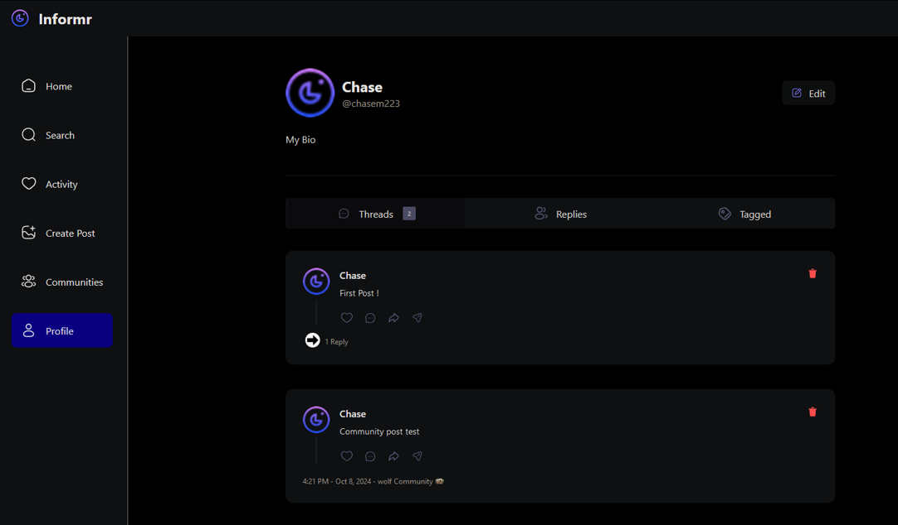

# Informr

Informr is a cutting-edge social media application designed to connect people and share information seamlessly. 

## Features

- **User Profiles:** Create and customize your personal profile.
- **Real-time Updates:** Stay informed with live updates and notifications.
- **Interactive Feed:** Engage with posts through likes, comments, and shares.
- **Secure Authentication:** Sign up and log in securely with Clerk authentication.

## Technologies Used

- **Next.js:** For server-side rendering and optimized performance.
- **React:** To build a responsive and interactive user interface.
- **MongoDB:** As the database to store user data and posts.
- **TailwindCSS:** To style user pages and profiles.
- **Clerk:** Used for user authentication and account creation.

## Application Layout

*Figure 1: User Account Page*

*Figure 2: Other User Account Page*
